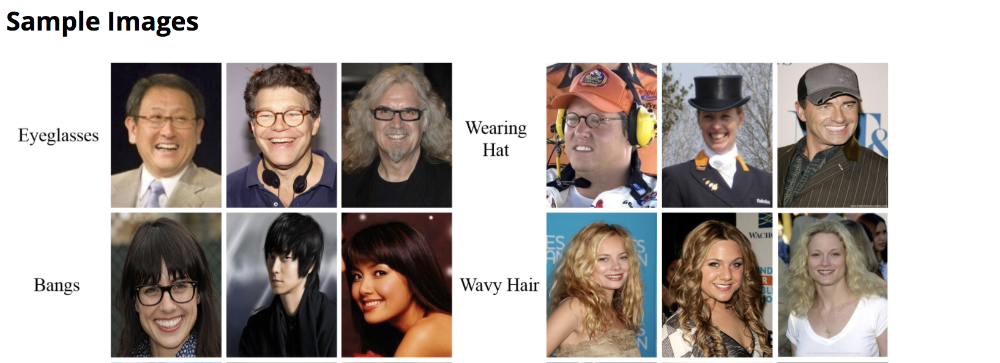

## _Generative Adversarial Nets_ and _Variational Auto-Encoders_


## What are GANs?

Generative Adversarial Networks (GAN) is a deep learning model and one of the most promising methods for unsupervised learning on complex distributions in recent years. The model produces a fairly good output through (at least) two modules in the framework: Generative Model and Discriminative Model.

Take a simple example,

Generative Model: produce new fake currency

Discriminative Model: Given a currency, detect whether it is fake or not.

Competition in this game drives both teams to improve their methods until the counterfeits are indistiguishable from the genuine
articles.

### Work Principle

Take generating picture as an example. We have a generator G, which generates a picture marked as G(z) based on the input noise z. The input x for D, the discriminator, represents a picture, where D(x) is the probability that x is a real picture.

We train D to maximize the probability of assigning the correct label to both training examples and samples from G. We simultaneously train G to minimize
log(1 − D(G(z))):


#### DataSet
Here use the [**CelebFaces Attributes Dataset(CelebA)**](http://mmlab.ie.cuhk.edu.hk/projects/CelebA.html) and the [**MNIST Dataset**](http://yann.lecun.com/exdb/mnist/). 

**CelebA** is a large-scale face attributes dataset with more than 200K celebrity images, each with 40 attribute annotations. The images in this dataset cover large pose variations and background clutter. CelebA has large diversities, large quantities, and rich annotations, including 10,177 number of identities, 202,599 number of face images, and 5 landmark locations, 40 binary attributes annotations per image.

The **MNIST** database consists of about 60.000 black and white images of handwritten digits, each with size 28x28 pixels². This dataset is preprocessed according for training GANs.




#### Networks

First define the generator network. The generator generates new data instances that are "similar" to the training data, in our case celebA images. Generator takes random latent vector and output a "fake" image of the same size as the training image(3x64x64).

In practice, this is
accomplished through a series of strided two dimensional convolutional
transpose layers, each paired with a 2d batch norm layer and a relu
activation. The output of the generator is fed through a tanh function
to return it to the input data range of $[-1,1]$. It is worth
noting the existence of the batch norm functions after the
conv-transpose layers, as this is a critical contribution of the DCGAN
paper. These layers help with the flow of gradients during training. An
image of the generator from the DCGAN paper is shown below.
        
##### Coding
```Markdown
class Generator(nn.Module):
    def __init__(self, ngpu):
        super(Generator, self).__init__()
        self.ngpu = 1
        self.main = nn.Sequential(
            # input is Z, going into a convolution
            nn.ConvTranspose2d(100, 512, 4, 1, 0, bias=False),
            nn.BatchNorm2d(512),
            nn.ReLU(True),
            # state size. (ngf*8) x 4 x 4
            nn.ConvTranspose2d(512, 256, 4, 2, 1, bias=False),
            nn.BatchNorm2d(256),
            nn.ReLU(True),
            # state size. (ngf*4) x 8 x 8
            nn.ConvTranspose2d(256, 128, 4, 2, 1, bias=False),
            nn.BatchNorm2d(128),
            nn.ReLU(True),
            # state size. (ngf*2) x 16 x 16
            nn.ConvTranspose2d(128, 64, 4, 2, 1, bias=False),
            nn.BatchNorm2d(64),
            nn.ReLU(True),
            # state size. (ngf) x 32 x 32 output:3x64x64
            nn.ConvTranspose2d(64, 3, 4, 2, 1, bias=False),
            nn.Tanh()
        )

    def forward(self, input):
        if input.is_cuda and self.ngpu > 1:
            output = nn.parallel.data_parallel(self.main, input, range(self.ngpu))
        else:
            output = self.main(input)
        return output

netG = Generator(ngpu).to(device)
netG.apply(weights_init)
if opt.netG != '':
    netG.load_state_dict(torch.load(opt.netG))
print(netG)
```

#### Discriminator

The discriminator evaluate the authenticity of provided images; it classifies the images from the generator and the original image. Discriminator takes true of fake images and output the probability estimate ranging between 0 and 1.

##### Coding

```Markdown
class Discriminator(nn.Module):
    def __init__(self, ngpu):
        super(Discriminator, self).__init__()
        self.ngpu = ngpu
        self.main = nn.Sequential(
            # input is 3 x 64 x 64
            nn.Conv2d(3, 64, 4, 2, 1, bias=False),
            nn.LeakyReLU(0.2, inplace=True),
            # state size. 64 x 32 x 32
            nn.Conv2d(64, 128, 4, 2, 1, bias=False),
            nn.BatchNorm2d(128),
            nn.LeakyReLU(0.2, inplace=True),
            # state size. (128) x 16 x 16
            nn.Conv2d(128, 256, 4, 2, 1, bias=False),
            nn.BatchNorm2d(256),
            nn.LeakyReLU(0.2, inplace=True),
            # state size. 256 x 8 x 8
            nn.Conv2d(256, 512, 4, 2, 1, bias=False),
            nn.BatchNorm2d(512),
            nn.LeakyReLU(0.2, inplace=True),
            # state size. 512 x 4 x 4
            nn.Conv2d(512, 1, 4, 1, 0, bias=False),
            nn.Sigmoid()
        )

    def forward(self, input):
        if input.is_cuda and self.ngpu > 1:
            output = nn.parallel.data_parallel(self.main, input, range(self.ngpu))
        else:
            output = self.main(input)

        return output.view(-1, 1).squeeze(1)
       
netD = Discriminator(ngpu).to(device)
netD.apply(weights_init)
if opt.netD != '':
    netD.load_state_dict(torch.load(opt.netD))
print(netD)
```


#### Optimizer

Here use ``Adam`` as the optimization algorithm for both neural networks 

```Markdown
# setup optimizer
optimizerD = optim.Adam(netD.parameters(), lr=opt.lr, betas=(opt.beta1, 0.999))
optimizerG = optim.Adam(netG.parameters(), lr=opt.lr, betas=(opt.beta1, 0.999))
```


## Intro to VAEs

Variational Encoder VAE (Variational Auto-encoder), like GAN, has become the most popular method for unsupervised learning of complex probability distributions.
Generally, it has an encoder and a decoder.


Random samples from learned generative models of MNIST for different dimensionalities
of latent space

### Experiments


**References**

1.Ian Goodfellow, Jean Pouget-Abadie, Mehdi Mirza, Bing Xu, David Warde-Farley, Sherjil Ozair, Aaron
Courville, and Yoshua Bengio. Generative adversarial nets. In NIPS, 2014.

2.Diederik P Kingma and Max Welling. Auto-encoding variational bayes. In ICLR, 2014

